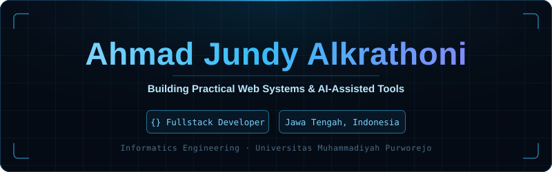

  <!-- HEADER UTAMA -->
  

    
  

   

  <!-- METRIK -->
  

    
    
    
  

  <!-- TERMINAL KODE -->
  

    
  

   

  <!-- TECH STACK -->
  

    
  

   

  <!-- STATISTIK -->
  

    
    
  

   

  <!-- STREAK -->
  

    
  

 

## Featured Projects

<table>
  <tr>
    <td width="50%" valign="top">
      <h3><a href="https://github.com/JundyAlka/Kasir-TokoMu-">Kasir TokoMu</a> &nbsp;<a href="https://kasir-toko-mu-nu.vercel.app">Live Demo</a></h3>
      
Sistem POS untuk TokoMu (PCM Grabag): transaksi kasir, manajemen stok, laporan penjualan, dan bagi hasil investor. Dilengkapi asisten AI untuk rekomendasi restock dan OCR nota supplier.

      
<code>TypeScript</code> <code>React</code> <code>Supabase</code> <code>AI/OCR</code>

    </td>
    <td width="50%" valign="top">
      <h3><a href="https://github.com/JundyAlka/PSTI-Fest_FuturisticRun-FunBike">PSTI Fest &mdash; Futuristic Run &amp; Fun Bike</a></h3>
      
Platform event resmi PSTI Fest: landing page, pendaftaran peserta Futuristic Run &amp; Fun Bike, dan pengelolaan data peserta dalam satu sistem.

      
<code>TypeScript</code> <code>React</code> <code>Tailwind</code>

    </td>
  </tr>
  <tr>
    <td width="50%" valign="top">
      <h3><a href="https://github.com/JundyAlka/KREASEA-AI-AUTO-CONTENT">KREASEA &mdash; AI Auto Content</a></h3>
      
Aplikasi mobile untuk membuat konten secara otomatis dengan bantuan AI, dibangun dengan Flutter agar berjalan lintas platform.

      
<code>Flutter</code> <code>Dart</code> <code>AI API</code>

    </td>
    <td width="50%" valign="top">
      <h3><a href="https://github.com/JundyAlka/Barakah-Sedekah-Subuh-App">Barakah &mdash; Sedekah Subuh App</a></h3>
      
Aplikasi mobile pencatatan dan pengingat sedekah subuh, lengkap dengan riwayat donasi dan tampilan yang bersih serta mudah dipakai.

      
<code>Flutter</code> <code>Dart</code>

    </td>
  </tr>
  <tr>
    <td width="50%" valign="top">
      <h3><a href="https://github.com/JundyAlka/SPK_Sentral_Padi">SPK Sentral Padi</a></h3>
      
Sistem Pendukung Keputusan berbasis web untuk membantu penentuan sentra produksi padi menggunakan perhitungan kriteria terstruktur.

      
<code>PHP</code> <code>MySQL</code> <code>Bootstrap</code>

    </td>
    <td width="50%" valign="top">
      <h3><a href="https://github.com/JundyAlka/JavaFX-ProjectManager">JavaFX Project Manager</a></h3>
      
Aplikasi desktop manajemen proyek dengan autentikasi pengguna, manajemen file CRUD, dan antarmuka modern. Ringan, aman, dan intuitif.

      
<code>Java</code> <code>JavaFX</code> <code>Maven</code>

    </td>
  </tr>
</table>

  

 

## About Me

- Mahasiswa **Teknik Informatika**, Universitas Muhammadiyah Purworejo
- Membangun **sistem nyata untuk kebutuhan nyata**: POS, inventori, SPK, dan aplikasi event
- Bekerja lintas platform: **web** (React/TypeScript, PHP), **mobile** (Flutter), dan **desktop** (JavaFX)
- Sedang mendalami integrasi **fitur AI** ke dalam aplikasi produksi
- Terbuka untuk kolaborasi proyek dan kesempatan magang

 

  
  
  

